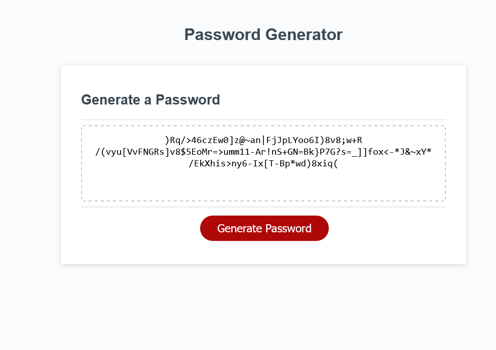

# JS-Challenge-Password-Generator

*Password generator with written JS code*

## Description

The task was to complete some pre-written javascript code to make a fully functional password generator. The HTML and CSS were provided already as the main focus was on the JS itself. This took some time to develop as you have to think out logically how the user will interact with the site step by step. A lot of variables had to be made to contain all of the character sets and then turn those character sets into a randomly generated password between 8 to 128 characters. Prompts, alerts, and confirms were used to display information to the user as well as inputting information. The password is then displayed inside the ID "password" at the very end. I did had some trouble towards the very end because of some minor oversights like not returning the generated password, using the wrong operators, the fail safe check not working, etc. The JS file has all of my commented notes to see where my thought process was at the time. 

## Screenshot

## Usage

Click on "Generate Password" button. You will then be prompted on how many characters you want your password to be, then click OK. Several prompts will then ask you to include lowercase letters, upercase letters, numbers, and special characters. Click OK to your desired choices. The site will refuse to generate your password if no character sets are chosen, so please pick at least one. The randomly generated password will then be displayed inside the box field.

## Deployment Link

Deployed Page: [Github Deployed Page](https://exo-mdr-cd2000.github.io/JS-Challenge-Password-Generator/)

Github repo: [JS-Challenge-Password-Generator](https://github.com/Exo-MDR-CD2000/JS-Challenge-Password-Generator)

<!-- fill out when done -->